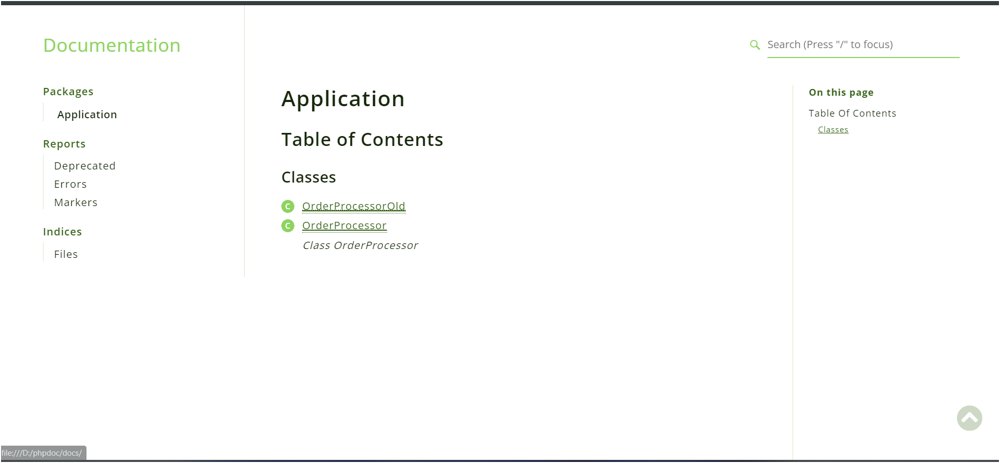
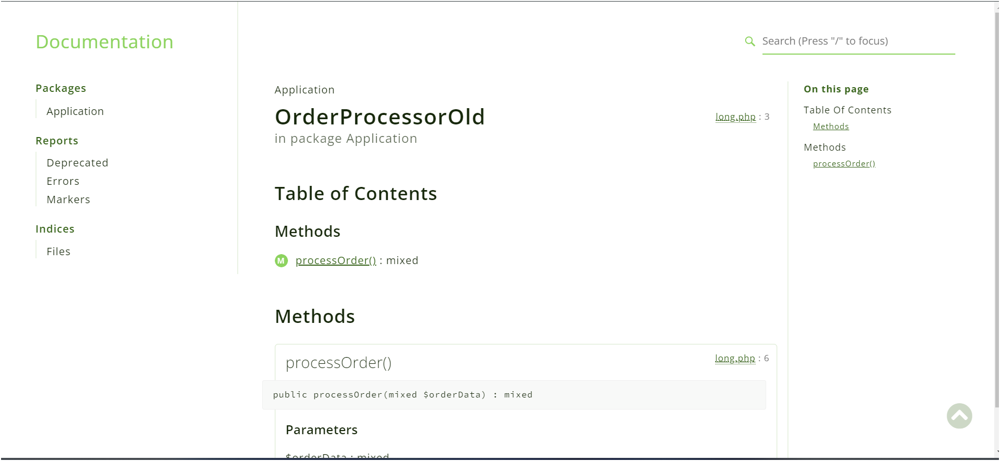
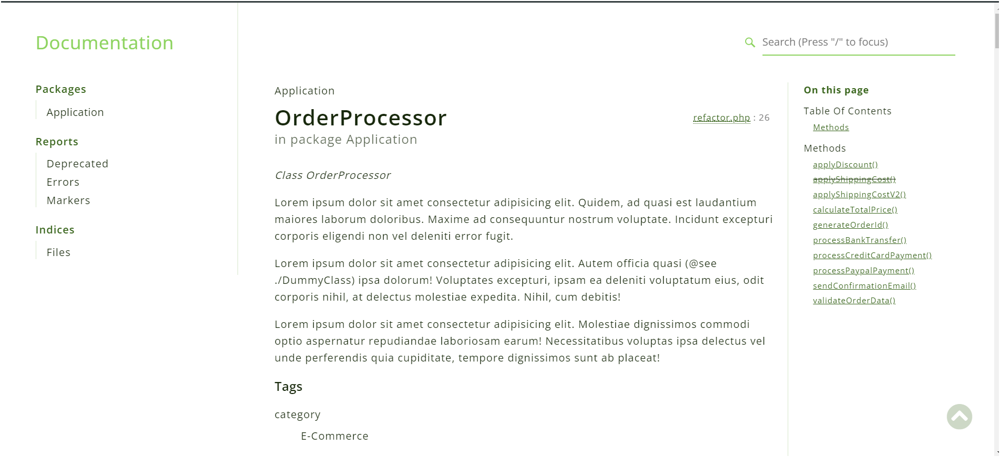
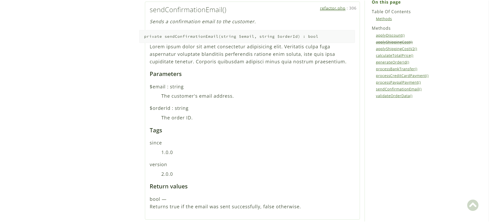

## Overview :computer:
**PHPDoc** is an essential tool for generating well-structured and detailed documentation for your PHP code. It helps in making your code easier to understand and maintain by providing structured comments that describe the functionality of functions, classes, and methods.

##### What is PHPDoc?
PHPDoc is commenting on code, that allows developers to write inline documentation. This documentation can then be extracted to generate easy-to-read HTML files using the PHPDocumentor tool.

##### Basic PHPDoc Syntax

```php
/**
 * Short description.
 *
 * Longer description explaining the function.
 *
 * @param string $param1 Description of the first parameter.
 * @param int    $param2 Description of the second parameter.
 * @return bool Return type description.
 */
function exampleFunction($param1, $param2) {
    // Function code here
    return true;
}
```

##### Key Tags:
- `@param` – describes a parameter of the function (type and name)
- `@return` – describes the return value
- `@throws` – describes exceptions thrown by the function
- `@deprecated` – indicates that the function is deprecated and should not be used

More can be found in [here](https://manual.phpdoc.org/HTMLSmartyConverter/HandS/phpDocumentor/tutorial_tags.abstract.pkg.html)


##### Pros of PHPDoc:
- **Improved Code Readability**: Clear and concise descriptions for each function and method.
- **Autogenerated Documentation**: Automatically generates documentation that can be shared with team members.
- **File-wise Documentation**: Easily navigable HTML documentation allows developers to focus on specific files or components.
- **Better Maintenance**: Provides detailed insight into code functionality, making it easier to maintain and refactor code.

##### Cons of PHPDoc:
- **Overhead for Large Functions**: Documenting large functions can lead to extensive comments that might make the code harder to read.
- **Risk of Outdated Documentation**: If the function changes and the PHPDoc is not updated, it can mislead developers.
- **Time-Consuming**: For large codebases, writing comprehensive PHPDoc comments can take time and effort.

## Small vs Long:
The eternal debate: small, refactored functions vs. one long monolithic function!  

When it comes to writing code, especially in PHP (or any other language), the decision between small, refactored functions and long, single functions is like choosing between a cozy studio apartment and a sprawling mansion. Both have their merits, but it ultimately depends on the context and your specific needs.


1. **Small, Refactored Functions:**
    
    These are like bite-sized code nuggets. You break down your logic into smaller chunks, each with a specific purpose.
   - **Pros:**
     - **Readability:** Smaller functions are easier to understand. You can name them descriptively, making your code self-documenting.
     - **Reusability:** When you have small functions, you can reuse them across different parts of your application.
     - **Testability:** Unit testing becomes a breeze. You can focus on testing individual functions without dealing with a tangled mess.
     - **Maintainability:** If you need to fix a bug or make an enhancement, you know exactly where to look.
   - **Cons:**
     - **Function Call Overhead:** There's a tiny performance hit due to function calls. But honestly, in most cases, it's negligible.
     - **Too Many Functions:** If you go overboard, you might end up with a function explosion. Aim for a balance.

2. **Long, Single Functions (The Monolith):**
 
    These are the "I'll do it all" functions. They handle everything from database queries to rendering HTML.
   - **Pros:**
     - **Simplicity:** You have one big function, and that's it. No jumping around.
     - **Performance:** Fewer function calls mean slightly better performance.
     - **Less "Function Hopping":** Sometimes, context-switching between small functions can be distracting.
   - **Cons:**
     - **Readability Nightmare:** Ever tried deciphering a 1000-line function? It's like reading a novel written by a sleep-deprived octopus.
     - **Testing Hell:** Good luck unit testing this beast. You'll need a whole pot of coffee.
     - **Maintenance Nightmare:** When something breaks, you'll need a detective hat and a magnifying glass.

**Recommendation:**
- **Refactor!** But not blindly. Here's a balanced approach:<sup>[1](https://refactoring.guru/smells/long-method) [2](https://detectors.auditbase.com/refactor-long-functions-solidity) [3](https://medium.com/codex/should-functions-be-small-e76b45aa93f) [4](https://www.codesee.io/learning-center/code-refactoring) [5](https://www.freecodecamp.org/news/best-practices-for-refactoring-code/) [6](https://www.altexsoft.com/blog/code-refactoring-best-practices-when-and-when-not-to-do-it/) [7](https://devopedia.org/code-refactoring) [8](https://www.geeksforgeeks.org/7-code-refactoring-techniques-in-software-engineering/)</sup>
  - **Start Small:** Begin with small functions. If a piece of code does more than one thing, consider breaking it down.
  - **Think Responsibly:** Each function should have a clear responsibility. If it's doing too much, split it.
  - **Red-Green-Refactor:** Remember the red-green-refactor cycle from test-driven development? Apply it here too. Write tests, refactor, and keep your codebase healthy.
  - **Abstraction FTW:** If you notice common functionality shared by multiple classes or methods, extract it into a separate, abstract class or interface or trait. 
  

### PHPDoc for Small Functions
PHPDoc works best for small, focused functions because it ensures that each parameter and return type is documented clearly. Here’s an example of a small function that benefits from PHPDoc:

```php
/**
 * Processes the order by validating input data, calculating total price, handling payment,
 * and sending confirmation.
 * 
 * @param array $orderData The order data containing customer information, items,
 * and payment details.
 * @return array|string Returns an array with order details on success, or an error 
 * message on failure.
 * 
 * @internal Lorem ipsum dolor sit amet consectetur adipisicing elit. Dignissimos ducimus,
 * necessitatibus, odio error consequuntur eius nostrum, quae alias aliquam quasi ullam!
 * Vitae debitis veniam provident, maxime voluptatem obcaecati voluptas ipsam.
 * 
 * @since 1.0.0
 * @version 2.0.0
 * @throws Exception
 */
public function processOrder($orderData): array|string
{
    // rest of code...

    // call small small functions
    $validationResult = $this->validateOrderData($orderData);
    $totalPrice = $this->applyShippingCostV2($totalPrice);
    $paymentResult = $this->processPayment($orderData, $totalPrice);
    $orderId = $this->generateOrderId();
    $emailSent = $this->sendConfirmationEmail($orderData['email'], $orderId);

    // ...rest of code
}
```

For small functions, PHPDoc makes the purpose and usage of each function immediately clear without cluttering the code.

#### Large Functions and Potential Issues
When dealing with large, complex functions, PHPDoc can become more cumbersome. Detailed documentation for every parameter, return value, and internal logic may result in large blocks of comments that could obscure the code itself. Here’s an example of a larger function where PHPDoc might be overwhelming:

```php
// long function with very less document
function processData($orderData) {
    // Complex function logic here
    return $processedData;
}
```

For large functions like this, it can be difficult to keep the PHPDoc in sync with the code, leading to potential issues if the function changes frequently. **Refactoring into smaller, modular functions can help both with maintainability and documentation clarity.**


### Example:
#### Refactoring with PHPDoc

In this repository, we have two files that cover the same `processOrder()` functionality:
- **`code/long.php`**
- **`code/refactor.php`**

### `long.php`
In the `long.php` file, there is a single large function that handles the entire order processing logic. This approach, while functional, makes it difficult to maintain, test, and document. The function is overly complex and documentation becomes difficult to write, making it harder for developers to understand and modify the function without breaking it.

### `refactor.php`
In contrast, the `refactor.php` file divides the large `processOrder()` function into smaller, well-documented functions. Each function is responsible for a specific task, with proper PHPDoc comments for each, ensuring clarity and maintainability.

Example from `refactor.php`:

```php
/**
 * Adds shipping cost to the total price based on the price thresholds.
 * 
 * Lorem ipsum dolor sit amet consectetur adipisicing elit. Esse velit iusto nihil sapiente voluptate 
 * aliquid ipsa rerum, officia cum iure rem, cupiditate excepturi tenetur fuga labore enim non a ullam.
 * 
 * @param float $totalPrice The total price of the items.
 * @return float The total price after adding shipping cost.
 * 
 * @since 1.0.0
 * @version 2.0.0
 */
private function applyShippingCostV2($totalPrice): float
{
    // shipping cost logic here (upgraded)
}

/**
 * @deprecated 2.0 Use applyShippingCostV2 instead.
 * 
 * Adds shipping cost to the total price based on the price thresholds.
 * 
 * @param float $totalPrice The total price of the items.
 * @return float The total price after adding shipping cost.
 * 
 * @since 1.1
 * @version 2.0.0
 */
private function applyShippingCost($totalPrice)
{
    // shipping cost logic here (deprecated)
}
```

By breaking the `processOrder()` functionality into smaller, self-contained functions, we:
- **Improve readability**: Each function performs a single task, making the logic easier to follow.
- **Enhance documentation**: Each function has a clear PHPDoc block, which is easier to maintain and update.
- **Enable unit testing**: Smaller functions can be tested individually, improving test coverage and reliability.
  
This refactoring approach ensures that future development and maintenance become more straightforward, as each function and its purpose are clearly defined.

## Generating HTML Documentation with PHPDocumentor

Once PHPDocumentor is installed (which is already present in the repo), you can generate the HTML documentation for the codebase, including the two example files, by running the following command from the root of the project:

```bash
php phpDocumentor.phar run -d . -t docs
```

This command will generate the HTML, CSS, and JS necessary for the documentation. *(This step is already done in this repo, You dont need to generate again, you can open doc/index.html. If you make any changes in code, then re-run the command)*

You can then open the `docs/index.html` file in a browser to view the documentation. Here’s an example of how it will look:



### Viewing `long.php`
First, click on **OrderProcessorOld**, which will open the HTML view for `long.php`. You will notice that there is not much information because the `processOrder()` function is large and lacks sufficient documentation:



### Viewing `refactor.php`
Now, go back and click on **OrderProcessor**, which will open the HTML view for `refactor.php`. Here, you will see detailed documentation for the file, which we added during development:



For example, consider clicking on the **sendConfirmationEmail** method in the right-hand navigation pane. You will see all the details of the method, including its parameters and return type:



This structured approach allows developers to easily understand each function's role, aiding in both development and future maintenance.

## Best Practices
- **Use PHPDoc for small, well-defined functions** to maintain clarity and ease of reading.
- **Refactor large functions into smaller units** where possible to simplify both the code and the documentation.
- **Keep PHPDoc comments updated** whenever you modify a function to prevent outdated information.
- **Generate HTML documentation regularly** to ensure you have an up-to-date, navigable overview of your code.

By following these guidelines, PHPDoc can significantly improve the maintainability and readability of your PHP projects. Powerful editors like **PHPStorm**<sup>[1](https://www.jetbrains.com/help/phpstorm/phpdoc-comments.html) [2](https://www.jetbrains.com/help/phpstorm/refactoring-source-code.html)</sup> and **VsCode**<sup>[1](https://docs.devsense.com/en/vscode/editor/refactoring) [2](https://code.visualstudio.com/docs/editor/refactoring)</sup> offer a wide range of features that make it easy to generate PHPdoc and refactor code.

#### Happy Coding!!! :collision::collision: